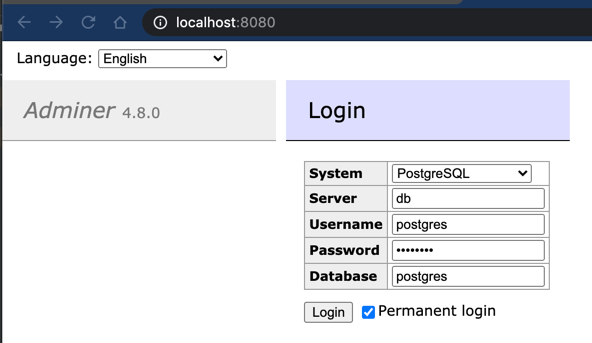
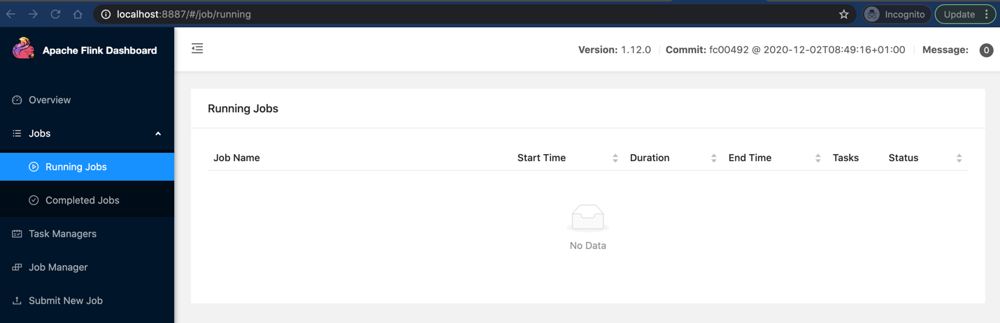

# Demon Hamster

Playground for Flink, Spring, Camel projects.

It does nothing right now.

postgres on 5432
jdbc:postgresql://localhost:5432/postgres

db admin tool on 8080

# Start the Stack
docker-compose -f stack.yml up

Server listening on port 8888

http://localhost:8888/hamster

Flink Console on port 8887

http://localhost:8887/#/job/running
